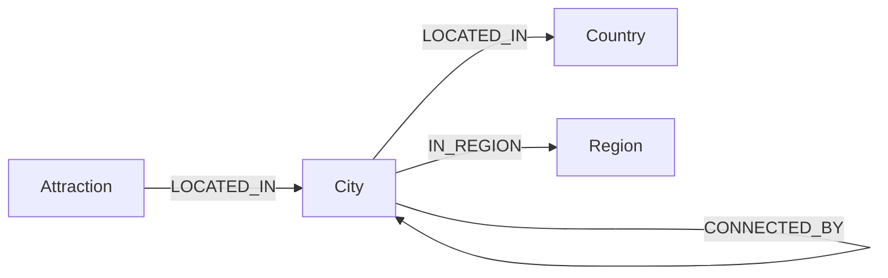
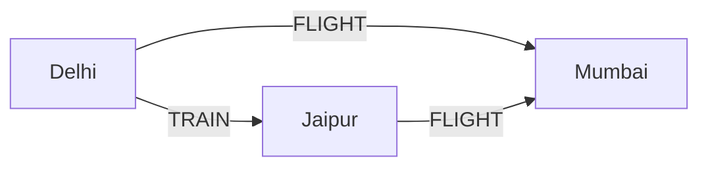
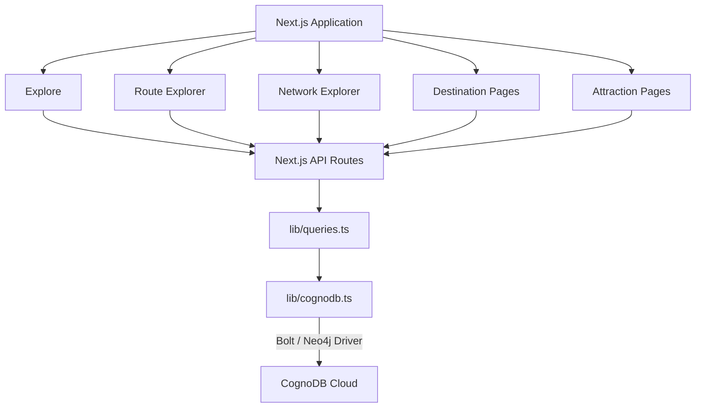

# RouteGraph

> **Wexa AI — CognoDB Take-Home Assignment**

RouteGraph is an interactive travel exploration and route-discovery application backed by **CognoDB**, a managed graph database compatible with the official Neo4j JavaScript driver.

The application models travel as a connected graph of **countries, regions, cities, attractions, and transportation relationships**. Instead of treating a journey as a simple origin/destination lookup, RouteGraph can explore direct connections and discover multi-hop journeys through intermediate cities.

---

## Live Demo

**Hosted application:** `ADD_DEPLOYED_APP_URL`

**GitHub repository:** `ADD_GITHUB_REPOSITORY_URL`

**Screen recording:** `ADD_SCREEN_RECORDING_URL`

---

## 1. What RouteGraph Does

RouteGraph provides four primary experiences.

### Explore

Browse destinations using data loaded into CognoDB.

Users can:

- Search cities and destinations
- Browse destination cards
- Open destination profiles
- View destination imagery and descriptions
- Discover attractions associated with a city
- Follow connections to other destinations

### Route Explorer

Compare possible journeys between two cities.

The application can surface:

- Direct routes
- Multi-hop routes
- Different transportation modes
- Journey duration
- Distance
- Number of stops
- Transportation sequences

For example:

```text
Delhi
 ├── FLIGHT ───────────────→ Mumbai
 ├── TRAIN ────────────────→ Mumbai
 └── TRAIN → Jaipur → FLIGHT → Mumbai
```

These paths are discovered from graph relationships rather than hard-coded city-to-city cases.

### Network Explorer

The Network view visualizes a city's transportation neighborhood as an interactive graph.

Users can:

- Search for a city
- Select a destination
- Inspect connected cities
- Drag graph nodes
- Zoom and pan
- Inspect transportation relationships
- Open the graph in a larger view

### Destination & Attraction Exploration

Destination pages combine city information with attractions and transportation relationships.

Attraction pages provide a focused view of individual points of interest.

---

## 2. Why a Graph Database?

Travel is fundamentally a **relationship-heavy problem**.

A destination is connected to:

- A country
- A region
- Attractions
- Other cities
- Multiple transportation modes
- Alternative paths through intermediate destinations

The interesting questions are therefore questions about **connections**.

For example:

> What transportation options connect Delhi and Mumbai?

The graph can represent:

```text
Delhi ──FLIGHT──→ Mumbai
Delhi ──TRAIN───→ Mumbai
```

A more interesting question is:

> What routes can reach Mumbai through other cities?

The graph can traverse:

```text
Delhi
  │
  └── TRAIN → Jaipur
                 │
                 └── FLIGHT → Mumbai
```

And with additional hops:

```text
Delhi
  │
  └── TRAIN → Agra
                │
                └── TRAIN → Jaipur
                              │
                              └── FLIGHT → Mumbai
```

In a relational design, arbitrary-depth traversal requires recursive queries or repeated joins across route data. As relationship depth increases, those queries become increasingly cumbersome.

In a graph model, the relationship itself is a first-class part of the data.

This makes graph traversal a natural fit for RouteGraph.

---

## 3. Graph Data Model



### Country

Represents a country.

Typical properties:

```text
id
name
code
```

### Region

Represents a geographical region associated with cities.

```text
id
name
```

### City

Represents a travel destination.

Properties include:

```text
id
name
latitude
longitude
description
image
tags
highlights
```

### Attraction

Represents a point of interest located within a city.

Properties include:

```text
id
name
type
description
image
rating
durationMinutes
bestTime
tags
```

---

## 4. Transportation Relationships

The central travel relationship is:

```text
(:City)-[:CONNECTED_BY]->(:City)
```

A `CONNECTED_BY` relationship contains transportation information such as:

```text
mode
durationMinutes
distanceKm
frequency
priceTier
overnight
```

Supported transportation modes include:

```text
FLIGHT
TRAIN
BUS
FERRY
```

The same pair of cities can therefore have multiple transportation relationships.

Conceptually:



This allows RouteGraph to compare transportation alternatives rather than assuming one route per city pair.

---

## 5. Example Graph Queries

### Direct connections

Which cities are directly connected to a selected city?

```cypher
MATCH (city:City {id: $cityId})
      -[route:CONNECTED_BY]-
      (destination:City)
RETURN
  destination.name AS destination,
  route.mode AS mode,
  route.durationMinutes AS durationMinutes,
  route.distanceKm AS distanceKm,
  route.frequency AS frequency
ORDER BY route.durationMinutes
```

### Attractions

Which attractions are located in a city?

```cypher
MATCH (attraction:Attraction)
      -[:LOCATED_IN]->
      (city:City {id: $cityId})
RETURN attraction
ORDER BY attraction.name
```

### Multi-hop traversal

Which graph paths can connect two cities?

```cypher
MATCH path =
  (start:City {id: $startCityId})
  -[:CONNECTED_BY*1..4]->
  (destination:City {id: $destinationCityId})

WITH
  path,
  nodes(path) AS cities,
  relationships(path) AS routes

RETURN
  cities,
  routes
ORDER BY length(path)
LIMIT 20
```

This is the core traversal behind the route explorer.

---

## 6. Application Architecture



The application follows:

```text
UI
 ↓
API routes
 ↓
Query/data layer
 ↓
Neo4j driver
 ↓
CognoDB
```

The browser never connects directly to CognoDB.

---

## 7. Technology Stack

| Layer | Technology |
|---|---|
| Frontend | Next.js 16 |
| Language | TypeScript |
| UI | React 19 |
| Styling | Tailwind CSS |
| Graph visualization | React Flow / `@xyflow/react` |
| Icons | Lucide React |
| Database | CognoDB Cloud |
| Query language | openCypher |
| Database protocol | Bolt |
| Database driver | Official `neo4j-driver` for JavaScript |
| Seed tooling | TypeScript / Node.js |

---

## 8. Project Structure

```text
app/
├── api/
│   ├── cities/
│   ├── routes/
│   ├── graph/
│   └── attractions/
│
├── explore/
├── routes/
├── network/
├── cities/
└── attractions/

components/
├── CitySearch.tsx
├── DestinationCard.tsx
├── RouteFinder.tsx
├── TravelGraph.tsx
└── Navbar.tsx

lib/
├── cognodb.ts
├── queries.ts
├── types.ts
└── destination-images.ts

scripts/
└── seed.ts

cypher/
└── schema.cypher
```

The important architectural boundary is:

```text
Presentation
     ↓
API
     ↓
Query layer
     ↓
Database driver
```

---

## 9. CognoDB Setup

Create a CognoDB Cloud instance from:

https://console.cognodb.com

The connection URI follows the form:

```text
bolt+s://<instance-id>.databases.cognodb.cloud
```

The generated credentials should be stored securely and never committed to Git.

The free tier is sufficient for the included demonstration dataset.

---

## 10. Environment Variables

Create `.env.local`:

```env
COGNODB_URI=bolt+s://<instance-id>.databases.cognodb.cloud
COGNODB_USERNAME=cognodb
COGNODB_PASSWORD=<your-password>
```

Never commit `.env.local`.

The repository should only contain an example configuration:

```env
COGNODB_URI=bolt+s://<instance-id>.databases.cognodb.cloud
COGNODB_USERNAME=cognodb
COGNODB_PASSWORD=your-password
```

---

## 11. Installation

```bash
git clone <YOUR_REPOSITORY_URL>
cd <YOUR_PROJECT_DIRECTORY>
npm install
```

Start development:

```bash
npm run dev
```

Open:

```text
http://localhost:3000
```

---

## 12. Database Schema

The schema is provided in:

```text
cypher/schema.cypher
```

It defines uniqueness constraints for:

```text
Country
Region
City
Attraction
Transport
```

It also defines indexes for commonly searched properties such as:

```text
City.name
Country.name
Attraction.name
```

and transportation relationship mode.

Run the contents of `cypher/schema.cypher` in the CognoDB query console before seeding.

---

## 13. Seed Data

The repository contains a reproducible seed script.

The seed process creates:

1. Countries
2. Regions
3. Cities
4. City-to-country relationships
5. City-to-region relationships
6. Attractions
7. City-to-attraction relationships
8. Transportation relationships

The seed process resets the RouteGraph dataset before recreating it, so it should be treated as a development/demo initialization operation.

Run the seed command defined in `package.json`.

For example:

```bash
npm run seed
```

---

## 14. Database Connection

Database connectivity is centralized in:

```text
lib/cognodb.ts
```

The application uses the official Neo4j JavaScript driver:

```ts
neo4j.driver(
  uri,
  neo4j.auth.basic(username, password)
);
```

Connection pooling and connection/acquisition timeouts are configured in the driver.

The application also exposes a connectivity verification function for graceful database failure handling.

---

## 15. Parameterized Queries

Database values are passed through Neo4j driver parameters.

Example:

```ts
executeQuery(query, {
  cityId,
});
```

Cypher:

```cypher
MATCH (city:City {id: $cityId})
```

This keeps application values separate from Cypher query text and avoids unsafe string-concatenated query construction.

---

## 16. Multi-Hop Route Discovery

The route finder is the main demonstration of graph traversal.

Given:

```text
startCityId
destinationCityId
```

the application searches paths containing multiple `CONNECTED_BY` relationships.

Conceptually:

```text
Start
  ↓
City A
  ↓
City B
  ↓
Destination
```

The route result can aggregate:

```text
Total duration
Total distance
Stops
Transportation modes
Cities visited
```

This allows the application to compare:

```text
Direct flight

vs.

Train + flight

vs.

Train + train + flight
```

without hard-coding those combinations.

---

## 17. Graph Visualization

The Network Explorer uses React Flow to visualize database-derived graph relationships.

The selected city is represented as the central node.

Connected cities are rendered as surrounding nodes.

Edges represent transportation relationships.

Users can:

- Drag nodes
- Zoom
- Pan
- Inspect the network
- Open a larger graph view

The visualization is generated from database results rather than a fixed list of graph nodes.

---

## 18. User Experience

The application is designed for non-technical users.

It provides:

- Destination imagery
- Search
- Destination cards
- Route comparison
- Interactive graph exploration
- Responsive layouts
- Loading states
- Empty states
- Database error handling
- Mobile-friendly interactions
- Accessible labels for interactive controls

The normal user experience uses travel terminology such as:

```text
Destinations
Routes
Connections
Attractions
Travel options
```

rather than exposing database implementation details.

---

## 19. Error Handling

Database failures are handled at the data-access/API boundary.

If CognoDB becomes unavailable, API requests return an error response instead of exposing database credentials or crashing the application.

Connection and acquisition timeouts prevent requests from hanging indefinitely.

The frontend can then present an appropriate error or empty state.

---

## 20. Security

CognoDB credentials are loaded exclusively from environment variables.

They are not stored in:

- React components
- API route source
- query files
- seed data
- committed configuration

The production flow is:

```text
Browser
   ↓
Next.js server
   ↓
Environment variables
   ↓
CognoDB
```

The browser never receives the CognoDB password.

Before publishing the repository, verify that no real credentials are present in the working tree or Git history intended for submission.

---

## 21. Demo Walkthrough

A concise demonstration can follow this sequence:

### 1. Explore

Search for a destination and open its destination page.

### 2. Destination

Inspect:

- Destination information
- Attractions
- Connected destinations

### 3. Route Explorer

Select an origin and destination.

Compare:

- Direct options
- Different transport modes
- Multi-hop alternatives

### 4. Network Explorer

Open the network view for the same city.

Show how the city's transportation relationships form an interactive graph.

### 5. Graph explanation

Use a multi-hop example such as:

```text
Delhi → Jaipur → Mumbai
```

to demonstrate why graph traversal is useful.

---

## 22. Design Decisions

### Next.js

Next.js provides a simple full-stack architecture where the UI and server-side API layer can live in one project.

### TypeScript

TypeScript makes the graph domain explicit through interfaces for:

```text
City
Country
Region
Attraction
Route
GraphNode
GraphEdge
RoutePath
```

### Official Neo4j Driver

CognoDB supports the Neo4j driver protocol, allowing RouteGraph to use the standard JavaScript driver rather than a custom database SDK.

### React Flow

The Network Explorer requires draggable nodes, zooming, panning and graph visualization. React Flow provides these interaction primitives.

---

## 23. What Makes RouteGraph Graph-Native?

RouteGraph does not simply store graph-shaped data while performing ordinary lookups.

Graph traversal directly powers user-facing features.

The route explorer asks the database questions about paths:

```text
City
 ↓
CONNECTED_BY
 ↓
City
 ↓
CONNECTED_BY
 ↓
City
```

The network explorer asks which relationships surround a city.

Destination exploration traverses:

```text
City
 ↓
LOCATED_IN
 ↓
Country
```

and:


Attraction
 ↓
LOCATED_IN
 ↓
City


The same graph model therefore powers multiple parts of the application.

---

## 25. Future Improvements

Potential future extensions include:

- Larger geographic coverage
- Additional transportation modes
- Time-aware schedules
- More detailed pricing data
- Route optimization based on user preferences
- Accessibility-aware routing
- Environmental impact comparisons
- More advanced graph analytics
- Personalized destination discovery

These are outside the core scope of the take-home assignment.

---

## 26. Production Build

Build:

```bash
npm run build
```

Start:

```bash
npm run start
```

The production environment must define:

```env
COGNODB_URI=...
COGNODB_USERNAME=...
COGNODB_PASSWORD=...
```

---

## . Closing

RouteGraph demonstrates a travel use case where the value of a graph database comes from the relationships between entities rather than isolated records.

The project combines:

```text
Graph modeling
       +
Cypher traversal
       +
CognoDB
       +
Official Neo4j driver
       +
Next.js
       +
Interactive visualization
       +
Travel-oriented UX
```

The central idea is:

> **Travel is a network, so RouteGraph models and explores it as one.**
